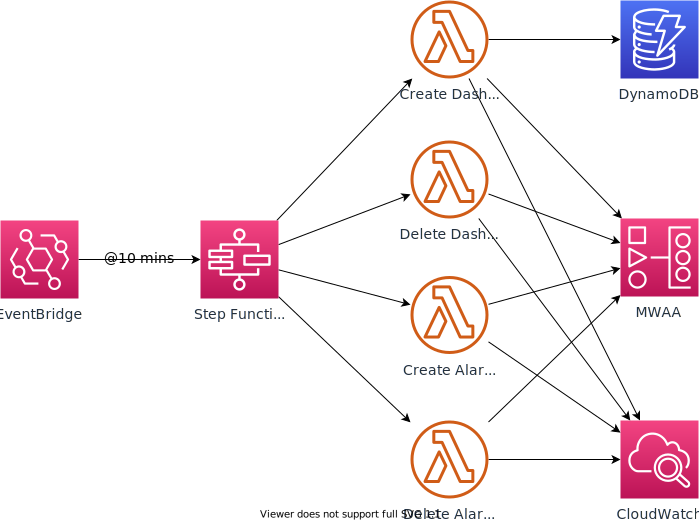

# CloudWatch Dashboard Automation for MWAA

Amazon Managed Workflows for [Apache Airflow](https://aws.amazon.com/managed-workflows-for-apache-airflow/) (MWAA) is a fully managed service that makes it easy to run open-source versions of Apache Airflow on AWS, and to build workflows to execute your extract-transform-load (ETL) jobs and data pipelines. When working with MWAA, you will often need to know more about the performance of your Airflow environment in order to improve performance or reduce costs. Airflow itself emits a number of useful metrics to [Amazon CloudWatch](https://aws.amazon.com/cloudwatch/), which are documented [here](https://docs.aws.amazon.com/mwaa/latest/userguide/access-metrics-cw-202.html). MWAA allows customers to define their own CloudWatch dashboards and alarms based upon the metrics and logs that Apache Airflow emits.

Airflow exposes metrics such as number of DAG processes, DAG bag size, number of currently running tasks, task failures, successes, etc. It does this constantly for each environment deployed. Airflow is already set up to send metrics for an MWAA environment to CloudWatch. We will automate the creation of a CloudWatch dashboard which displays several of these key metrics, along with CloudWatch alarms. These alarms receive notifications when the metrics fall outside of the thresholds that you configure, and allow you to perform actions in response.


This solution includes:

1. An EventBridge scheduled rule to invoke a Step Function
2. Step Function orchestrates several Lambda functions to query the existing MWAA environments
3. Lambda functions will update the CW dashboard definition to include metrics such as QueuedTasks, RunningTasks, SchedulerHeartbeat, TasksPending, TotalParseTime, etc.
4. CloudWatch alarms will be created for unhealthy workers and heartbeat failure across all MWAA environments. These alarms will be removed for any nonexistent environments.
5. Any MWAA environments that no longer exist will have their respective CW dashboards removed

## Architecture Diagram



## Step Functions State Machine


## CloudWatch Dashboard


## Build & Deploy

### Prerequisites

- Docker
- [AWS SAM CLI](https://docs.aws.amazon.com/serverless-application-model/latest/developerguide/serverless-sam-cli-install.html)

### Build the application

Building in a container will help alleviate any local dependency issues.

`sam build --use-container`

### Deploy

`sam deploy --guided`

This command will package and deploy your application to AWS, with a series of prompts:

- **Stack Name:** The name of the stack to deploy to AWS CloudFormation. This should be unique to your account and region. We will use `mwaa-dashboard` throughout this project.
- **AWS Region:** The AWS region you want to deploy your app to.
  Confirm changes before deploy: If set to yes, any change sets will be shown to you before execution for manual review. If set to no, the AWS SAM CLI will automatically deploy application changes.
- **Allow SAM CLI IAM role creation:** Many AWS SAM templates, including this example, create AWS IAM roles required for the AWS Lambda function(s) included to access AWS services. By default, these are scoped down to minimum required permissions. To deploy an AWS CloudFormation stack that creates or modified IAM roles, the `CAPABILITY_IAM` value for `capabilities` must be provided. If permission isn’t provided through this prompt, to deploy this example you must explicitly pass `--capabilities CAPABILITY_IAM` to the `sam deploy` command.
- **Save arguments to** `samconfig.toml`: If set to yes, your choices will be saved to a configuration file inside the project, so that in the future you can just re-run `sam deploy` without parameters to deploy changes to the application.

### Updating the CloudWatch dashboard template definition in DynamoDB

The CloudWatch dashboard template definition is stored in DynamoDB. This is a one-time setup step, performed by the `functions/seed_dynamodb` Lambda custom resource at stack deployment time. However, if you wish to override the template, you can either edit the data directly in DynamoDB using the AWS Management Console, or modify the `scripts/dashboard-template.json` file and update DynamoDB using the `scripts/seed.py` script.

```bash
cd scripts && ./seed.py -t <dynamodb-table-name>
cd ..
```

Here, `<dynamodb-table-name>` is the name of the DynamoDB table created during the `sam deploy` step. For example:

`./seed.py -t mwaa-dashboard-DashboardTemplateTable-VA2M5945RCF1`

## View the CloudWatch Dashboards

If you have any existing MWAA environments, or create new ones, a dashboard for each will appear with the `Airflow-` prefix. If you delete an MWAA environment, the corresponding dashboard will also be deleted. No CloudWatch metrics will be deleted.

## Conclusion

When you're done using this application, you may delete the resources you created to avoid ongoing charges. You can use the AWS CLI, AWS Management Consoles, or the AWS APIs to delete the CloudFormation stack deployed by SAM. You can also delete the CloudWatch logs for both the Lambda functions to avoid incurring charges there as well.
